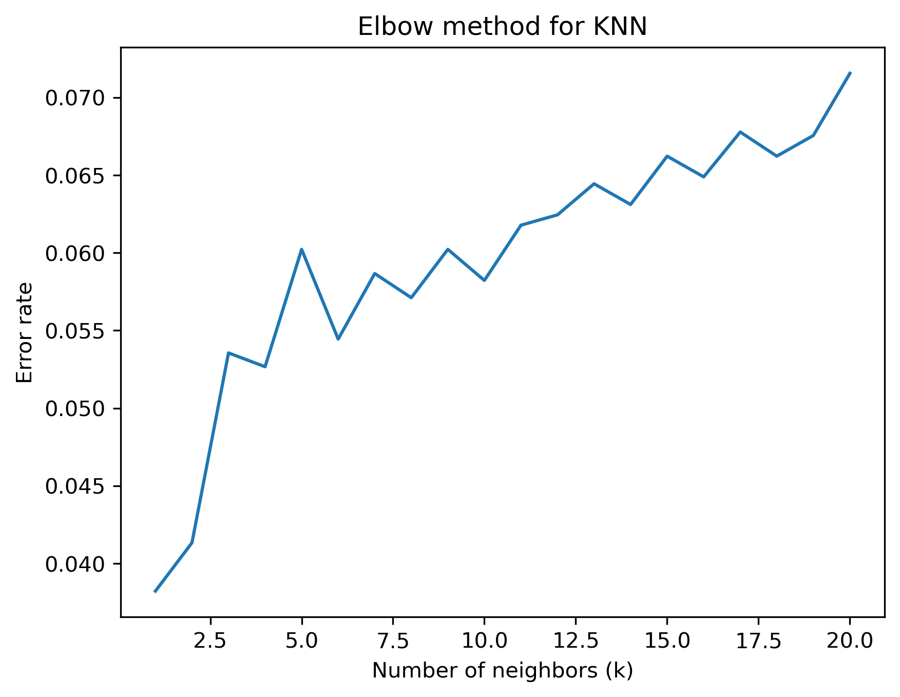
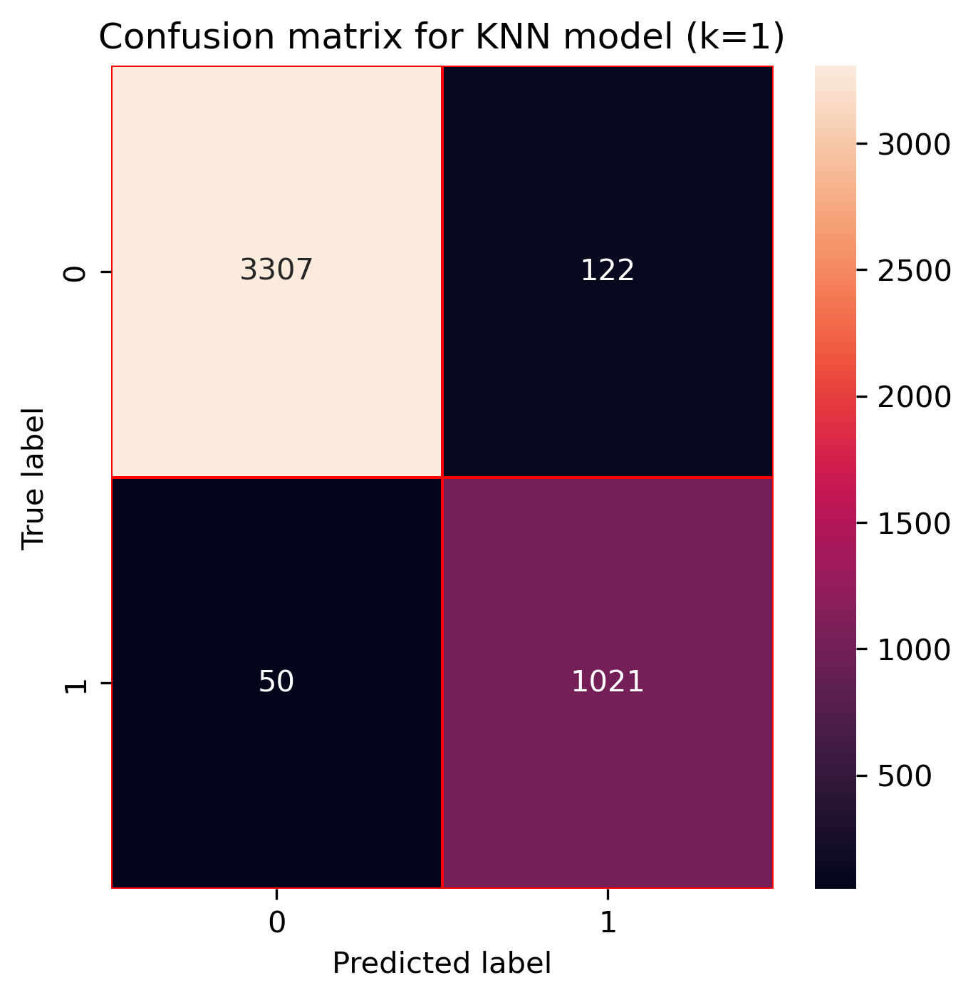
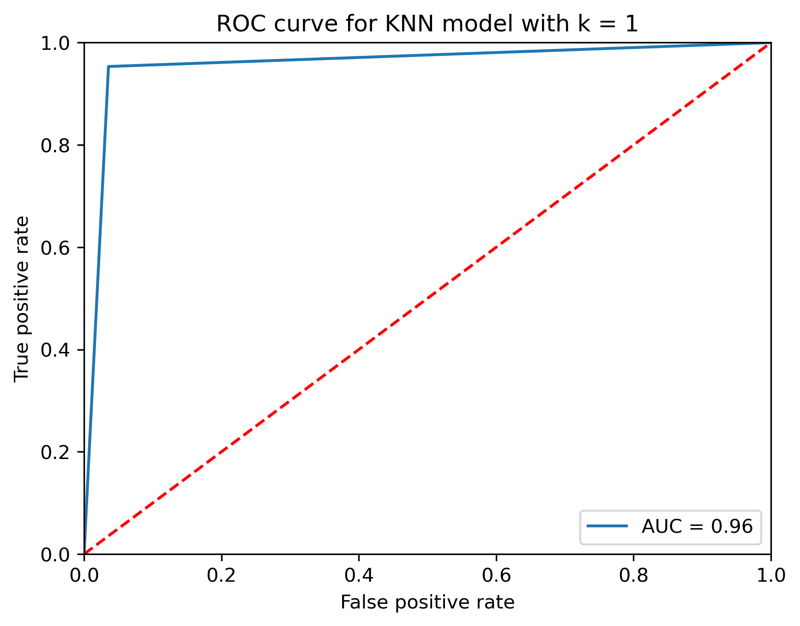

# Employee attrition prediction using K-Nearest Neighbors (KNN)

## Project overview

Employee attrition is an important business problem because losing experienced employees can increase recruitment costs and reduce productivity.

This project uses the K-Nearest Neighbors (KNN) algorithm to predict whether an employee is likely to leave the company based on workplace and employee-related characteristics.

## Objectives

- Prepare employee data for KNN classification.
- Standardize features before model training.
- Evaluate different values of `k`.
- Analyze the relationship between the number of neighbors and classification error.
- Evaluate the final model using a confusion matrix and ROC curve.

## Dataset

The dataset contains employee-related variables such as satisfaction level, performance evaluation, number of projects, average monthly hours, time spent at the company, salary level, and department.

The target variable is `left`:

- `0`: Employee stayed at the company.
- `1`: Employee left the company.

Dataset file: `recursos_humanos.csv`

## Methodology

The project follows these main steps:

1. Data exploration and preprocessing.
2. Categorical feature encoding.
3. Train-test split.
4. Feature standardization.
5. KNN model training.
6. Evaluation of different values of `k`.
7. Final model evaluation using classification metrics.

## Selecting the number of neighbors

Different values of `k` were evaluated by comparing their error rates. In this dataset, the lowest error rate was obtained with `k = 1`.

As `k` increases, the model becomes more general and may favor the majority class. Since the dataset is imbalanced, this can reduce sensitivity to employees who left the company.

## Model evaluation

The final KNN model uses `k = 1`.

### Confusion matrix

The confusion matrix shows that the model correctly classified most employees in both classes, while maintaining strong detection of employees who left the company.

### ROC curve

The model achieved an AUC of approximately **0.96**, indicating strong discrimination between employees who stayed and employees who left.

## Conclusions

The KNN classifier achieved strong predictive performance on the employee attrition dataset. Testing different values of `k` showed that `k = 1` produced the lowest observed error rate.

The confusion matrix and ROC analysis indicate that the model performs well in distinguishing between employees who stayed and those who left. However, because `k = 1` can produce a model with relatively high variance, additional validation could be useful for evaluating its generalization performance.

## Future improvements

Future work could include:

- Selecting `k` using cross-validation rather than a single test split.
- Comparing additional distance metrics and weighting strategies.
- Evaluating performance using F1-score and precision-recall curves.
- Comparing KNN with other classification algorithms.

## Repository structure

- `employee-attrition-knn.ipynb` — Complete analysis and KNN modeling workflow.
- `recursos_humanos.csv` — Dataset used in the project.
- `images/` — Project visualizations.
- `README.md` — Project documentation.
